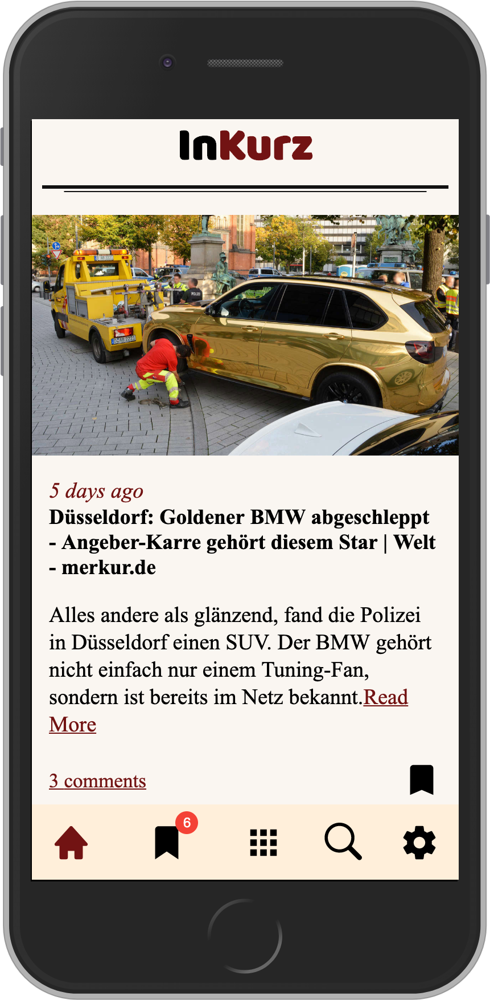
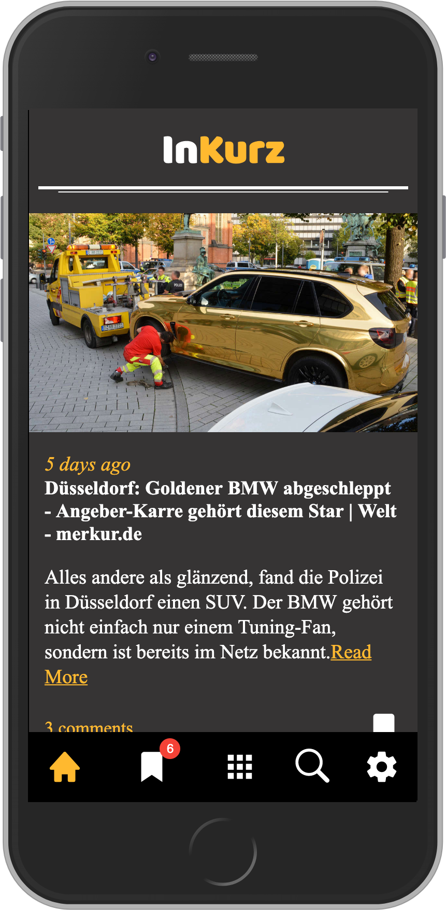
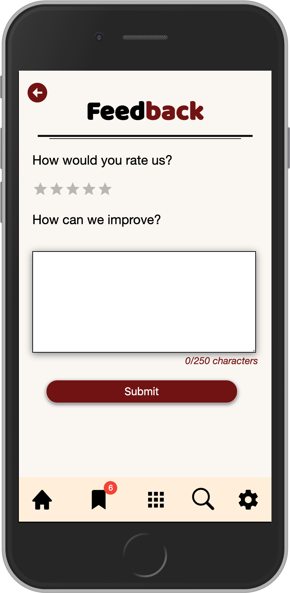
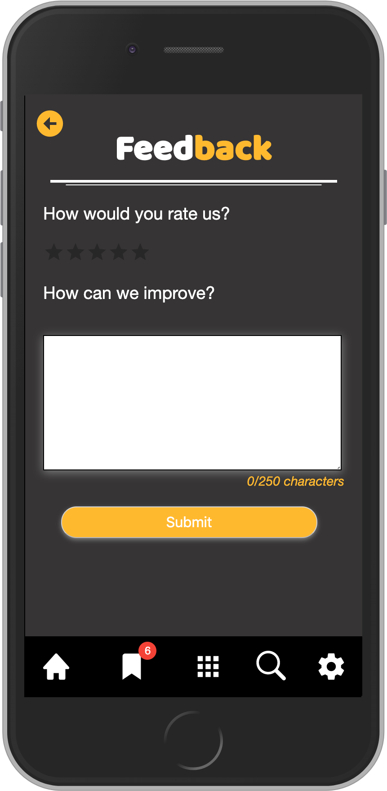
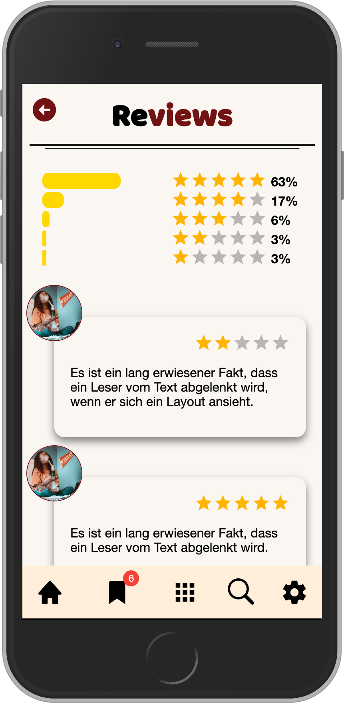

# InKurz news app

Simple news app created with React frontend, Node.js backend and MongoDB database

## Table of Contents

- [Introduction](#introduction)
- [Technologies](#technologies)
- [Setup](#setup)
- [Images](#images)

## Introduction

## Technologies

## Setup

## Images

|                     Light mode                      |                     Dark mode                      |
| :-------------------------------------------------: | :------------------------------------------------: |
|  |  |
|  |  |
|   |   |
